# Quadruped Rough-Terrain RL: Algorithm Comparison & LLM-Integrated Feedback

Master's thesis research codebase.

**Goals**
1. Systematic benchmark of RL algorithms (PPO, TRPO, A3C, SAC, TD3, DDPG) for
   quadruped rough-terrain locomotion across 3 robots × 12 terrains × 10 seeds.
2. LLM-integrated feedback RL: translating natural-language human feedback into
   reward signals via LLMs, combined with traditional rewards.

**Quick start**
```bash
make install          # uv sync (creates .venv, installs from uv.lock)
make test             # pure-logic unit tests
make smoke            # 1-minute end-to-end sanity run
```

See `CLAUDE.md` for conventions and `docs/` for protocols.

## Phase 1 Results — Which algorithm walks best?

Unitree A1, trained per algorithm with identical rewards and observations
(3 seeds; deterministic evaluation). Full analysis: [docs/findings.md](docs/findings.md),
raw table: `data/results/phase1_results_table.csv`.

| Algorithm | Flat v (succ.) | Stairs v (succ.) | Rough ±5cm v (succ.) |
|---|---|---|---|
| PPO | **1.030 ± 0.008** (100%) | 1.041 ± 0.006 (100%) | 0.883 ± 0.181 (67%) |
| TRPO | 1.021 ± 0.023 (100%) | **1.092 ± 0.012** (100%) | 0.875 ± 0.255 (67%) |
| SAC | 0.806 ± 0.234 (100%) | 0.988 ± 0.025 (100%) | **0.941 ± 0.002** (**100%**) |
| TD3 | 0.790 ± 0.315 (100%) | 0.956 ± 0.076 (33%) | 0.876 ± 0.027 (**100%**) |
| DDPG (OU / param) | 0.045 / 0.473 (0%) | – | – |

**The reliability story inverts with terrain**: on flat, on-policy (PPO/TRPO) is
near-deterministic across seeds while off-policy varies; on irregular rough
ground, off-policy (SAC/TD3) converges every seed while on-policy fails 1/3 —
SAC is the most robust rough-terrain algorithm (also best CoT and fewest falls).

Stairs velocity differences are statistically significant
(ANOVA p=0.015, η²=0.71; Tukey: TRPO > TD3, d=2.5).

### Gait gallery (deterministic policies, best seed)

| | Flat | Stairs (easy) | Rough (±5 cm bumps) |
|---|---|---|---|
| PPO | 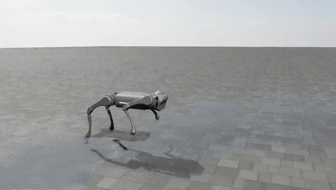 | 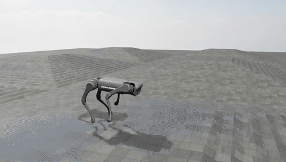 | 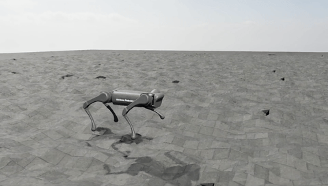 |
| TRPO | 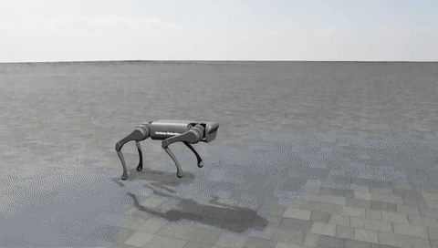 | 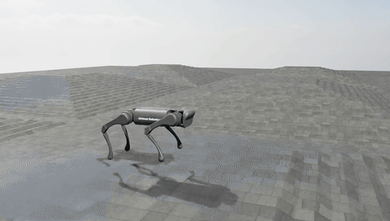 | 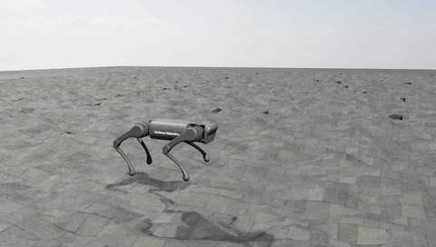 |
| SAC | 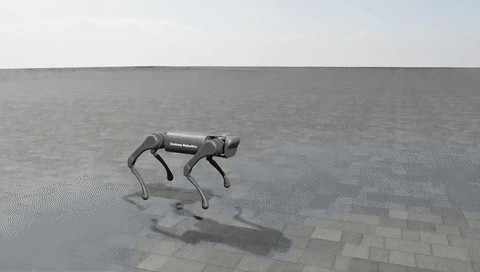 | 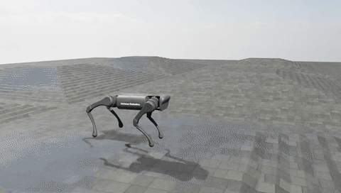 | 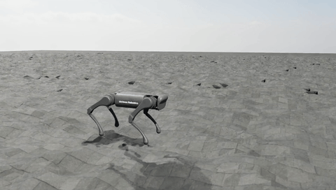 |
| TD3 | 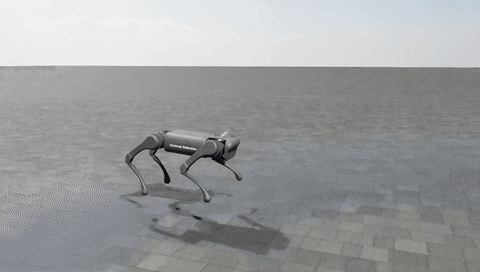 | 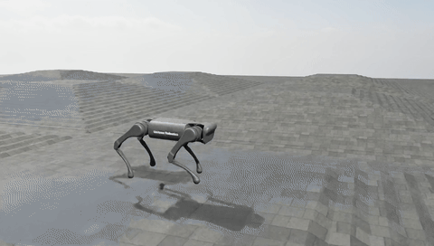 | 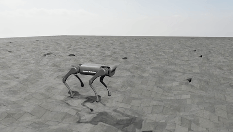 |

**Why DDPG fails** — exploration alone doesn't fix it (TD3's algorithmic changes do):

| DDPG + OU noise (0.045 m/s) | DDPG + parameter noise (0.473 m/s) |
|---|---|
| 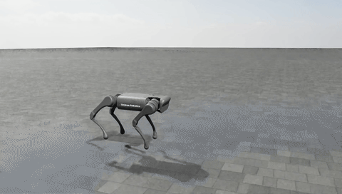 | 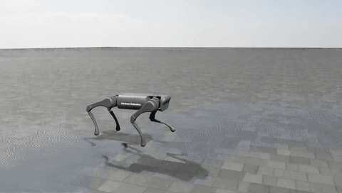 |

High-quality MP4s of every clip are in [docs/media/](docs/media/).

