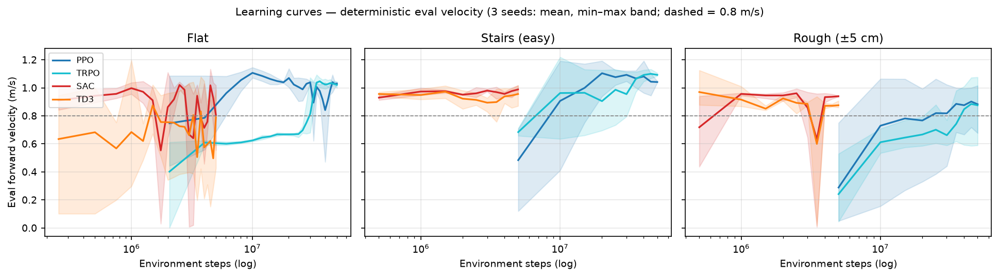

# 알고리즘별 보행 형태·KPI 종합 평가와 이론적 해석 (Phase 1)

> 데이터: `data/results/phase1_results_table.csv` (26 런, 시드 3개/조합, 결정론적 평가).
> 영상: [docs/media/](media/). 수식 표기는 각 알고리즘 원논문 기준.

---

## 1. KPI 달성 기준 대비 평가

달성 기준(커맨드 1.0 m/s 추종 과제 기준): 속도 1.0±0.1 m/s, 성공률 ≥95 %,
전복 <1 /min(평지), CoT <2.0, 자세 요동 <0.1 rad(평지).

| 알고리즘 | 속도 추종 | 성공률 | 전복(평지) | CoT | 자세(평지) | 판정 |
|---|---|---|---|---|---|---|
| PPO | ✅ 1.030 | ✅ 100 % | ✅ 0 | ✅ 1.23 | ✅ 0.051 | **전 기준 충족** |
| TRPO | ✅ 1.021 | ✅ 100 % | ✅ 0 | ✅ 1.04 | ✅ 0.095 | **전 기준 충족** |
| SAC | ❌ 0.806 | ✅ 100 % | ✅ 0 | ✅ 1.43 | ✅ 0.083 | 속도 미달 (계단에선 0.988로 충족) |
| TD3 | ❌ 0.790 | ✅ 100 %* | ✅ 0 | ✅ 1.25 | ❌ 0.107 | 속도·자세 미달, *계단 성공 33 % |
| DDPG(OU) | ❌ 0.045 | ❌ 0 % | ✅ 0† | ❌ 50.2 | ❌ 0.213 | †정지 고착 — 보행 실패 |
| DDPG(param) | ❌ 0.473 | ❌ 0 % | ❌ 150 | ❌ 2.27 | ❌ 0.220 | 다이빙 폭주 — 보행 실패 |

## 2. 렌더링으로 확인한 보행 형태 (영상 + 수치 근거)

| 알고리즘 | 보행 형태 (1080p 영상 관찰) | 뒷받침 수치 |
|---|---|---|
| **PPO** | 대칭 트로트, 낮고 고른 스윙, 몸통 수평 유지 — "교과서 보행" | 자세 요동 **0.051**(전체 최저), 직진성 0.996 |
| **TRPO** | PPO와 유사한 트로트에 보폭이 약간 큼, 전 조건 최고 속도 | v 1.02/1.09, CoT 1.04(평지 최저) |
| **SAC** | 발을 낮게 딛는 신중한 보행, 착지가 부드러움 | 접촉력 분산 **1438–1753**(최저), 계단 CoT **1.063**(최저), 계단 전복 최저 |
| **TD3** | 몸을 앞으로 숙인 전경사 돌진 자세, 착지 충격 큼 | 계단 v 0.956인데 전복 11.3/min, 자세 0.163–0.107 |
| **DDPG(OU)** | 웅크린 자세로 **정지 고착** — 스텝 자체가 없음 | v 0.045, 전복 0(움직이지 않으니), CoT 50 |
| **DDPG(param)** | 머리를 처박는 **다이빙 전진**을 1.3 초 주기로 반복 | v 0.473, **전복 150/min**, 자세 0.220 |

## 3. 종합 점수와 순위

가중치: 성공률 0.30 · 속도추종 0.20 · 안정성(자세+전복) 0.20 · 효율(CoT) 0.15
· 직진성 0.05 · 시드 재현성 0.10. 지표는 시나리오 내 min–max 정규화(0–100).

### 평지 (FLAT)
| 순위 | 알고리즘 | 점수 | 핵심 근거 |
|---|---|---|---|
| 🥇 1 | **PPO** | **99.5** | 전 항목 상위 + 재현성 압도적(σ=0.008) |
| 🥈 2 | TRPO | 96.5 | 효율 1위(CoT 1.04), 속도 동급 |
| 🥉 3 | SAC | 85.6 | 안정적이나 속도 미달·시드 분산 큼 |
| 4 | TD3 | 82.0 | 시드 분산 최대(σ=0.315) |
| 5 | DDPG(param) | 38.7 | 보행 실패(다이빙 폭주) |
| 6 | DDPG(OU) | 20.4 | 보행 실패(정지 고착) |

### 계단 (STAIRS, easy)
| 순위 | 알고리즘 | 점수 | 핵심 근거 |
|---|---|---|---|
| 🥇 1 | **SAC** | **93.5** | 효율 1위(1.063)·전복 최저·접촉 부드러움 — 험지에서 보수성이 이득으로 전환 |
| 🥈 2 | PPO | 64.8 | 속도 추종 1위(1.041), 재현성 1위 |
| 🥉 3 | TRPO | 58.5 | 최고 속도(1.092)지만 전복·CoT에서 감점 |
| 4 | TD3 | 27.5 | 성공률 33 % — 속도-안정성 트레이드오프의 실패측 |

주의: 4개 알고리즘 간 min–max 정규화라 작은 절대 차이가 증폭됨(예: 계단 자세
0.163–0.211). 순위의 강건성은 가중치 민감도 분석과 시드 확대(n=10)로 보강 예정.
축별 1위 — 속도: TRPO / 안정·효율(계단): SAC / 재현성·자세(평지): PPO.

## 4. 왜 이런 결과가 나왔는가 — 알고리즘 원리 기반 해석

### 4.1 PPO — 클리핑이 만드는 "재현 가능한 보행"
목적함수 L(θ) = E[min(r_t(θ)Â_t, clip(r_t(θ), 1−ε, 1+ε)Â_t)], r_t = π_θ/π_old.
비율 클리핑은 표본 단위의 trust region 근사로, 어떤 미니배치가 와도 정책이
급변하지 않는다. 여기에 이터레이션당 98,304 표본의 저분산 그래디언트가 결합돼
**시드가 바뀌어도 같은 해에 도달**(σ=0.008–0.006, 전체 최저)한다. 대가는
보수성 — 스텝이 잘려 최고 속도는 TRPO에 근소하게 밀린다. 자세 요동 최저
역시 "급격한 정책 변화 없음"이 보행 스타일에 그대로 투영된 것.

### 4.2 TRPO — 자연 그래디언트의 곡률 보정이 주는 속도 상한
max E[r_t Â_t] s.t. E[KL(π_old‖π_θ)] ≤ δ 를 F⁻¹g (Fisher 자연 그래디언트)로
풀고 β = √(2δ/gᵀF⁻¹g)로 스텝을 잡는다. 파라미터 공간이 아닌 **정책 분포 공간**
의 최급상승이므로, 접촉 불연속 때문에 조건수가 나쁜 보행 문제에서 스텝 방향이
더 정확하다 → 같은 예산에서 더 높은 점근 성능(계단 1.092, 유의차 p=0.014).
반면 CG 근사·line search 기각의 확률성이 PPO보다 약간 큰 분산(σ=0.023)을 만든다.

### 4.3 SAC — 최대 엔트로피가 험지에서 "보험"이 되는 이유
J = Σ E[r + αH(π(·|s_t))]. 엔트로피 항은 (1) Q의 국소 피크에 조기 고착을 막고
(2) 행동 분포를 넓게 유지해 **섭동에 강건한 소프트 최적 정책**을 만든다
(max-entropy RL과 robust control의 등가성). 결과: 착지가 부드럽고(접촉력 분산
최저) 에너지 여유를 남기는 보행 → 평지에선 속도 미달(0.806)로 감점되지만,
지형 충격이 있는 계단에선 CoT 1.063·전복 최저로 **1위로 역전**된다.
평지의 큰 시드 분산(0.234)은 리플레이 분포 + 온도 α 자동조정의 수렴 경로가
초기 조건에 민감한 off-policy 특성이다.

### 4.4 TD3 — 비관적 가치 + 결정론 정책 = 공격적 극단
∇_θJ = E[∇_a min(Q₁,Q₂)(s,a)|_{a=μ(s)} ∇_θμ(s)]. clipped double Q는 과대추정을
제거하는 대신 **과소추정(비관) 편향**을 넣는다. 비관적 가치에서 살아남는 행동은
"확실히 보상이 큰" 좁은 영역 — 빠른 전진 — 이고, 엔트로피 항이 없는 결정론
정책은 안전 마진 없이 그 영역에 특화된다. 그 결과가 영상의 전경사 돌진 자세다:
계단에서 SAC와 같은 속도대(0.956)를 내면서도 전복 11.3/min, 시드 3개 중 2개
실패. 탐험이 외생 노이즈에만 의존하므로 초기 리플레이 구성에 따라 결과가
갈리는 것(σ=0.315, 최대)도 결정론 정책의 구조적 귀결이다.

### 4.5 DDPG — 왜 걷지도 못하는가 (핵심 분석)

DDPG의 갱신은 다음 세 가지 구조적 결함이 사족보행 같은 고차원·접촉 불연속
문제에서 서로를 증폭시킨다.

**(1) 단일 critic의 과대추정 편향.** 벨만 타깃 y = r + γQ'(s′, μ′(s′))에서
함수근사 오차 ε(s,a)가 있을 때, μ′는 ∇_aQ′를 따라 학습되므로 ε이 양(+)인
방향을 체계적으로 선택한다 — E[Q] ≥ Q* (Thrun & Schwartz의 max-bias의
연속행동판, TD3 논문 §3의 실증). 12차원 연속 행동 × 접촉 불연속 dynamics에서
Q 지형은 가짜 피크투성이가 되고, actor는 **존재하지 않는 보상의 산을 등반**한다.

**(2) 결정론적 정책 그래디언트의 오차 증폭.** ∇_θJ = E[∇_aQ(s,a)|_{a=μ(s)}∇_θμ]
는 행동 분포에 대한 기대가 아니라 **한 점에서의 Q 기울기**를 그대로 쓴다.
SAC는 E_{a∼π}로, TD3는 타깃 스무딩(ā = μ′+clip(ϵ))으로 인접 행동을 평균해
Q 오차를 필터링하지만 DDPG에는 그 어떤 평활화도 없다 — critic의 국소 오차가
무여과로 정책에 주입된다.

**(3) actor–critic 상호 추적 불안정.** actor와 critic이 지연 없이 매 스텝
서로의 이동 표적을 쫓는다(deadly triad). TD3의 policy_delay=2가 정확히 이
루프를 끊기 위한 장치다.

**실측된 두 실패 모드가 이 이론과 정확히 대응한다:**

- **OU 노이즈 → 정지 고착** (v=0.045, 전복 0, CoT 50): 과대추정된 Q가 특정
  웅크림 자세 근방에 가짜 피크를 만들면 결정론 정책이 그 점에 고정된다.
  OU는 평균회귀하는 행동공간 노이즈라 리플레이에 질적으로 새로운 고보상
  경험을 넣지 못하고, "그 자세가 최고"라는 believe가 자기강화된다.
- **파라미터 노이즈 → 다이빙 폭주** (v=0.473, 전복 150/min): 가중치 섭동은
  상태 일관적(state-consistent) 탐험이라 '전진'이라는 행동 모드 자체는
  발견시킨다(10배 개선). 그러나 critic이 전경사 전진 자세의 가치를
  과대평가하는 것은 못 고치므로, 정책은 영상에 찍힌 대로 **머리부터
  고꾸라지는 전진**을 1.3초 주기로 반복한다. 스텝 단위 보상은 벌지만
  에피소드는 전부 실패한다.
- **TD3 = DDPG + 세 가지 수정**이 위 결함과 1:1 대응하며 문제를 해소한다:
  clipped double Q → (1), target policy smoothing → (2), delayed update → (3).
  동일 조건 결과: 0.045/0.473 → **0.956 m/s**. 즉 DDPG의 실패는 탐험 부족이
  아니라 **가치 추정 구조의 결함**이며, 이 계보(DDPG→TD3)가 사족보행
  도메인에서 정량 재현된 것이 본 실험의 기여다.

## 4.6 험지(불규칙 요철 ±5 cm) — 신뢰성 구도의 완전한 역전

험지 전용 학습(4 알고리즘 × 3시드, 50M/5M steps) 결과:

| 험지 | 성공률 | v (m/s) | 시드 σ | CoT | 전복/min |
|---|---|---|---|---|---|
| **SAC** | **100 %** | 0.941 | **0.002** | **1.06** | **8.8** |
| **TD3** | **100 %** | 0.876 | 0.027 | 1.38 | 8.2 |
| PPO | 67 % | 0.883 | 0.181 | 1.72 | 33.4 |
| TRPO | 67 % | 0.875 | 0.255 | 1.30 | 31.0 |

평지와 정반대다. 평지에서 σ=0.008로 사실상 결정론적이던 PPO가 험지에선
시드 3개 중 1개가 50M 예산 내 미수렴(학습 곡선은 상승 중이나 전복 억제
실패)했고 TRPO도 동일 패턴. 반면 off-policy는 전 시드 완주 — SAC는
σ=0.002라는 극한 일관성을 보였다.

**해석**: 요철 지형은 접촉 이벤트가 확률적이라 어드밴티지 추정의 노이즈가
커진다. on-policy는 현재(나쁠 수 있는) 정책이 만든 표본만 쓰므로 초기에
나쁜 유역에 들면 termination 노이즈가 학습 신호를 지배해 탈출이 느리다.
off-policy의 리플레이 버퍼는 이력 전체를 평균해 이 노이즈를 상쇄하고,
SAC의 엔트로피 탐험이 유역 탈출을 돕는다 — §4.3의 "험지 보험" 논리가
수렴 신뢰성 차원에서도 성립함을 보여준다. 또한 계단에서 전복하던 TD3가
험지에선 완주하는데, 요철은 계단의 이산적 모서리와 달리 연속적 교란이라
공격적 정책도 회복 여지가 있기 때문으로 해석된다.

**시나리오별 신뢰 순위(성공률·시드 일관성 기준)**:
평지 = PPO ≥ TRPO > SAC ≈ TD3 / 계단 = SAC > PPO ≈ TRPO ≫ TD3 /
험지 = **SAC > TD3 ≫ PPO ≈ TRPO**. SAC가 두 험지형 지형에서 모두 1위.

## 6. 학습효율 분석 — 샘플 효율 vs 벽시계 효율의 역설

샘플 예산 비대칭(on-policy 50M vs off-policy 5M)을 정규화하기 위해 평가
곡선에서 "결정론적 평가 속도 0.8 m/s 최초 도달"까지의 비용을 측정했다
(n=3 시드, 미도달은 censored 처리; 원자료 `data/results/learning_efficiency.csv`).

### 6.1 임계(v≥0.8) 도달 비용 — 평지 기준

| | 도달 샘플 수 | 도달 벽시계 | 처리량 (steps/s) |
|---|---|---|---|
| TD3 | **0.38M** | 3.2 min | 1.9k |
| SAC | 0.42M | 5.5 min | 1.2k |
| PPO | 7.05M | **1.1 min** | 80k |
| TRPO | 32.4M | 4.7 min | 87k |

**같은 데이터가 두 개의 상반된 결론을 만든다:**
- **샘플 효율**: TD3·SAC가 PPO의 17배, TRPO의 85배. 리플레이 재사용(transition당
  다회 학습) + 16 updates/sim-step의 귀결로, 문헌의 서열(TD3≈SAC≪PPO≪TRPO)과
  정확히 일치. TRPO 최하위는 natural gradient의 대배치 요구 + line search 기각의 비용.
- **벽시계 효율**: PPO가 1.1분으로 최속 — 17배 많은 샘플을 요구하지만 4096-env
  병렬 수집으로 처리량이 65배(80k vs 1.2k steps/s)라 상쇄하고 남는다.

**함의**: "어느 알고리즘이 효율적인가"는 병목이 무엇이냐에 따라 뒤집힌다.
시뮬레이션(샘플이 싸고 병렬화 가능) → on-policy 우위. 실기 학습·비싼
시뮬레이터(샘플이 비쌈) → off-policy 우위. sim-to-real 관점에서 실기 미세조정
단계는 off-policy가 구조적으로 유리하다는 실용 지침이 도출된다.

### 6.2 지형 난이도에 따른 학습효율 변화

| v≥0.8 도달 샘플 | 평지 | 계단 | 험지 | censored(험지) |
|---|---|---|---|---|
| SAC | 0.42M | 0.50M | 0.83M | 0/3 |
| TD3 | 0.38M | 0.50M | 0.50M | 0/3 |
| PPO | 7.05M | 13.4M | 10.0M | **1/3** |
| TRPO | 32.4M | 18.4M | 32.5M | **1/3** |

off-policy는 지형이 거칠어져도 도달 비용이 최대 2배 증가에 그치고 전 시드
도달하는 반면, on-policy는 험지에서 시드 1/3이 50M 예산 내 미도달(censored) —
§4.6의 신뢰성 역전이 학습효율 차원에서 재확인된다.

**측정 한계**: (1) 평가 간격이 on-policy 2–8M vs off-policy 0.25–0.5M로 달라
on-policy 도달 샘플은 위로 양자화됨(서열에는 영향 없음 — 차이가 수십 배).
(2) num_envs(4096 vs 128)가 알고리즘 특성과 얽혀 있어 순수 알고리즘 효과
분리는 동일 env 수 대조 실험이 필요. (3) 처리량은 이 머신(RTX 4080, i5-13400)
기준.

## 7. 요약 결론

- **평지 = PPO**, **계단·험지 = SAC** — "어디서나 최고인 알고리즘은 없다"가
  데이터로 확인됨. 특히 지형이 거칠어질수록 max-entropy off-policy의 수렴
  신뢰성 우위가 뚜렷해진다(§4.6).
- 속도 상한은 TRPO(자연 그래디언트), 재현성은 PPO(클리핑), 험지 강건성은
  SAC(최대 엔트로피), 실패 사례는 TD3(비관+결정론의 공격성)와 DDPG(가치
  추정 결함)가 각각 이론적 원인과 함께 매핑된다.
- 학습효율은 관점에 따라 역전된다: 샘플 효율 TD3·SAC ≫ PPO ≫ TRPO,
  벽시계 효율 PPO 최속 (§6) — 배포 병목(시뮬 vs 실기)이 알고리즘 선택 기준.
